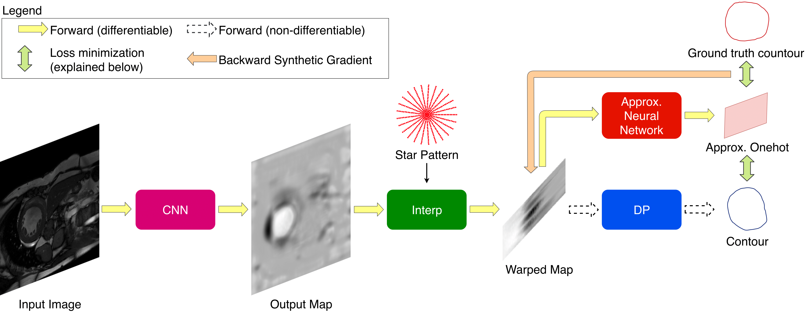
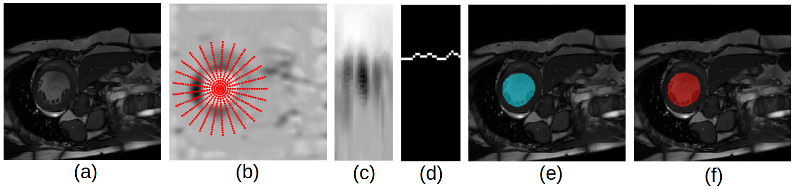
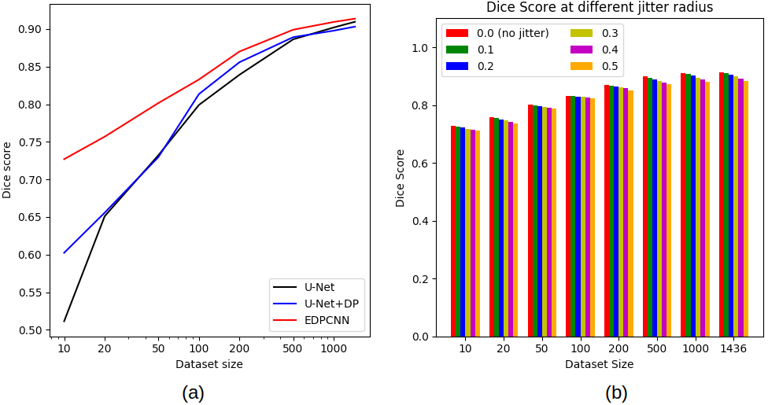

# Introduction
Code for our paper: [End-to-end Learning of Convolutional NeuralNet and Dynamic Programming 
for Left Ventricle Segmentation](https://drive.google.com/file/d/1X8TkRHZlQoQd67_0282fTucwPzF_YL3B/view?usp=sharing)

## Pipeline overview:

## Example

(a) input image 
(b) Output Map with an examplar star pattern 
(c) Warped Map 
(d) output contour
(e) output segmentation
(f) ground truth segmentation

# Requirements
- Numpy
- Pytorch >= 0.4
- TensorboardX
- Shapely
- Matplotlib
- Scipy
- Scikit-image
- Opencv for python
- nibabel
- h5py

# How to run
- Download the ACDC dataset. Extract the zip file into a folder. Change the `input_folder` path in `acdc/acdc_data.py`. Then from this repository root folder,
run `PYTHONPATH=$PYTHONPATH:$(pwd) python acdc/acdc_data.py` to build to preprocessed data. Alternatively, you can create a folder call 'preproc_data' and download the dataset hdf5 file from this [Google Drive](https://drive.google.com/drive/folders/1H0pkN32TRJkhwa5ZQq8Sc0R4NuqTkHqB?usp=sharing) link.

- The experiments can be found in 3 files `run_sg.py`, `run_sg_param_test.py`, `run_unet.py`.

- The main files used to train are `train_sg.py` and `train_unet.py`. Example how to run them can be found
in the experiments files.

- For evaluation, refer to `eval_sg.py`, `eval_unet.py` and `eval-unet-dp.py`

# Note
- This code only works on GPUs, preferrably NVIDIA ones with at least 10GB of VRAM. For GPUs with less VRAM, lowering the batch size may help.

- Due to the non-deterministic nature of large matrices reduction operations on GPU, the results over multiple runs will be slightly different but they usually have very similar loss curve and final performance.

- Sometime the training of the original U-Net may diverge on 10 training images, simply restart the run script if this occurs.

# Result

(a) Ablation study: Performance of U-Net vs EDPCNN with increasing dataset size.

(b) EDPCNN robustness with respect to the accuracy of the center.
