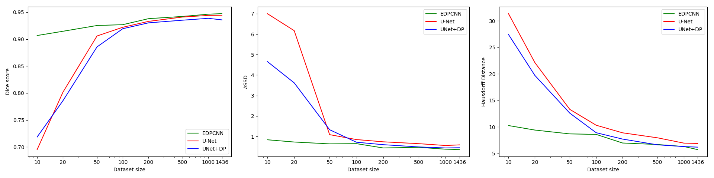
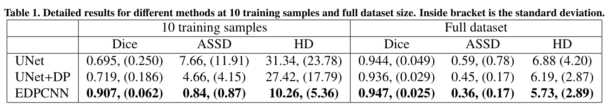

# Introduction
Code for our paper: [End-to-end Learning of Convolutional Neural Net and Dynamic Programming 
for Left Ventricle Segmentation](https://arxiv.org/abs/1812.00328)

## Pipeline overview:

## Example

(a) input image 
(b) Output Map with an examplar star pattern 
(c) Warped Map 
(d) output indices for each radial line in the star pattern
(e) output segmentation
(f) ground truth segmentation

# Requirements
- Numpy
- Pytorch >= 0.4
- TensorboardX
- Shapely
- Matplotlib
- Scipy
- Scikit-image
- Opencv for python
- nibabel
- h5py

# How to run
- Download the ACDC dataset. Extract the zip file into a folder. Change the `input_folder` path in `acdc/acdc_data.py`. Then from this repository root folder,
run `PYTHONPATH=$PYTHONPATH:$(pwd) python acdc/acdc_data.py` to build to preprocessed data. Alternatively, you can create a folder call `preproc_data` and download the dataset hdf5 file from this [Google Drive](https://drive.google.com/open?id=1B7JC3WVSq1CcPJmYc3RGfhVFL12BWNKJ) link.

- The experiments can be found in 3 files `run_edpcnn.py`, `run_edpcnn_param_test.py`, `run_unet.py`.

- The main files used to train are `train_edpcnn.py` and `train_unet.py`. Example how to run them can be found
in the experiments files.

- For evaluation, refer to `eval_edpcnn.py`, `eval_unet.py` and `eval_unet+dp.py`

# Note
- This code only works on GPUs, preferrably NVIDIA ones with at least 10GB of VRAM. For GPUs with less VRAM, lowering the batch size may help.

- Due to the non-deterministic nature of large matrices reduction operations on GPU, the results over multiple runs will be slightly different but they usually have very similar loss curves and final performance.

- Sometime the training of the original U-Net may diverge and never go above 20% dice score on train set with only 10 images, simply restart the run script if this occurs.

# Result
- Dice score, ASSD and Hausdorff distance on validation set vs training set size

- Detailed results when trained with full dataset

